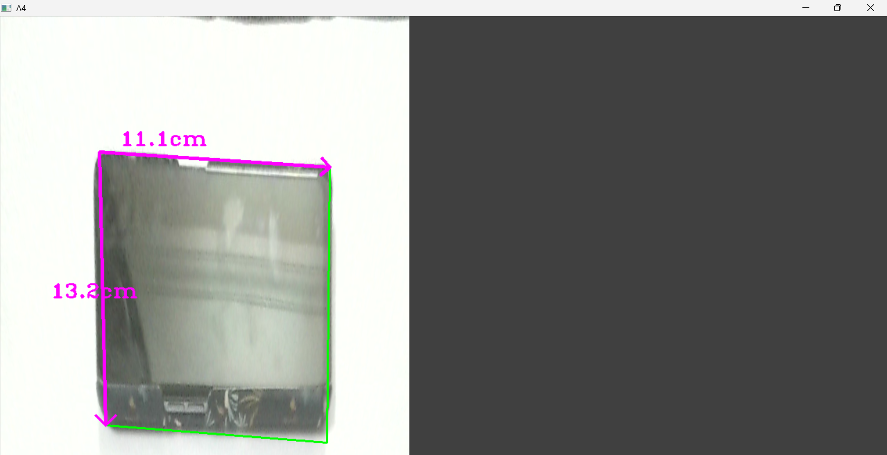
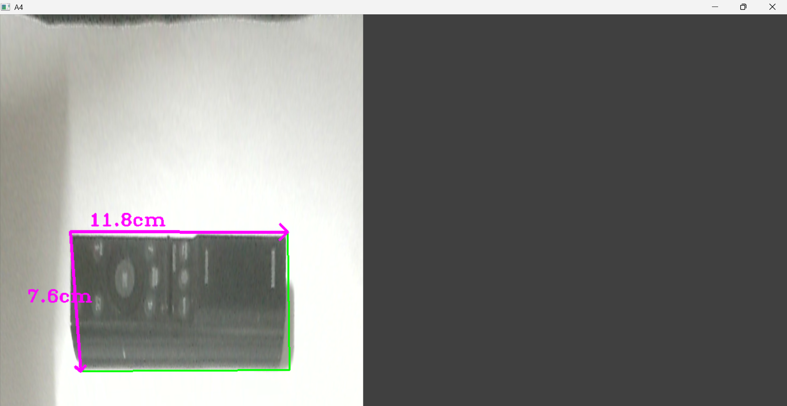
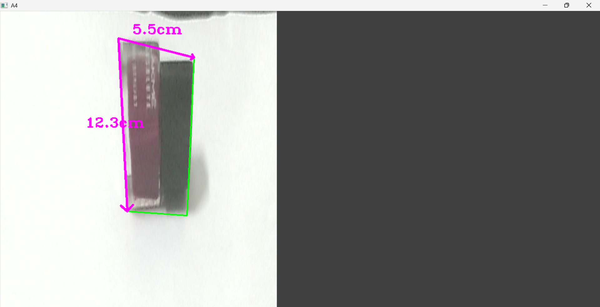

**Object Measurement Using OpenCV**:

This project measures the real-world dimensions of objects using Python and OpenCV.
An A4 sheet (210mm × 297mm) is used as a reference to compute the pixel-to-centimeter ratio after perspective warping.
The program works with webcam or image input, detects objects placed on the A4 sheet, and annotates their width and height.

**🚀 Features:**

Works with webcam or static image

Measures object width and height (cm)

Contour detection and polygon approximation

Accurate top-down warp of A4 paper for measurement

Utility functions for contour filtering, point ordering, warping, and distance calculation

Draws arrows + labels on objects directly in the output frame

Automatically falls back to image mode if webcam is not available

**📂 Project Structure:**

OBJMEASUREMENTPROJ/

│── ObjectMeasurement.py   # Main script (your measurement program)

│── utlis.py               # Helper functions for contours & warping

└── __pycache__/           # Auto-generated Python cache files

**🛠️ Requirements:**

Install dependencies:

pip install opencv-python numpy

Or with a requirements file:

pip install -r requirements.txt

Python version recommended: 3.8+

**▶️ How to Run:**
1. Run with Webcam (Default)
python ObjectMeasurement.py

Your webcam must be connected.
Press q to quit.

2. Run with an Image

Inside ObjectMeasurement.py, change:

webcam = False
path = '1.jpg'

Then run:

python ObjectMeasurement.py

**🔎 How It Works:**
1. Detect A4 Sheet

The program uses getContours() to detect the largest 4-sided contour in the frame (A4 sheet).

2. Warp Perspective

The detected sheet is warped to:

width = 210mm × scale

height = 297mm × scale

This gives a top-down, distortion-free measurement view.

3. Detect Objects

Objects placed on the sheet are detected using contour filtering.

4. Convert Pixels → Centimeters
cm_value = (pixel_distance / scale) / 10

5. Annotate Output

Pink arrows show measured sides

Text labels show width & height

Bounding boxes are drawn around the detected object

**🧩 Utility Functions Explained (utlis.py):**
getContours()

Finds and filters contours

Supports Canny thresholds, minimum area, and polygon filtering

Returns:

[num_points, area, approx, bbox, contour]

reorder()

Ensures the four detected points are ordered:

top-left

top-right

bottom-left

bottom-right

warpImg()

Applies perspective transform to warp the A4 sheet into a perfect rectangle.

findDis()

Finds Euclidean distance between two points (x, y).

**📌 Tips for Best Accuracy:**

Use a clean, flat A4 sheet

Avoid shadows and uneven lighting

Keep the entire paper visible in the frame

Place objects fully inside the A4 boundaries

Use a high-resolution webcam or image

 **📸 Output Examples:**

 Example 1  

 Example 2  

 Example 3  

